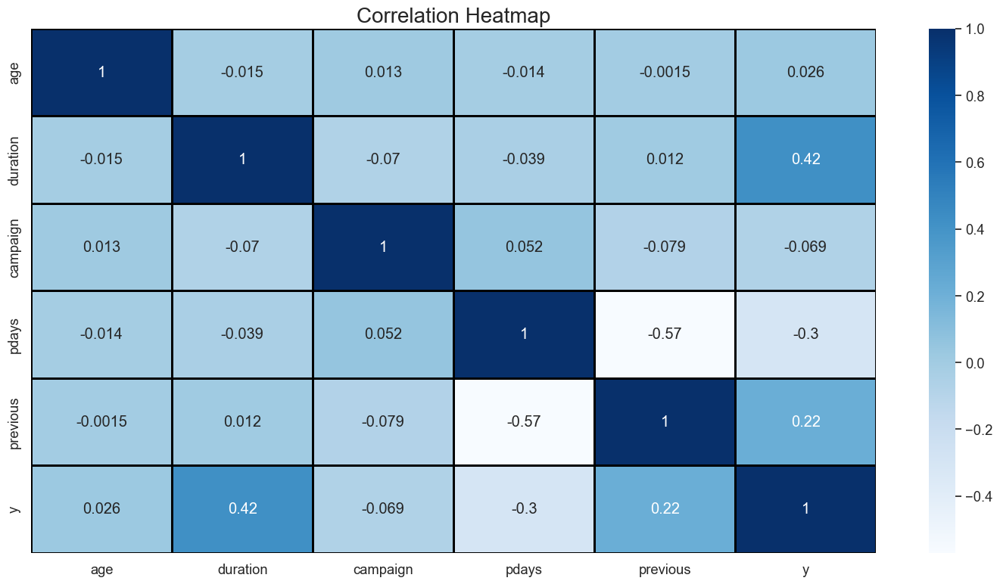
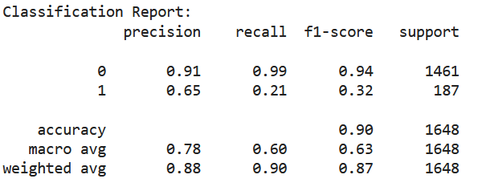
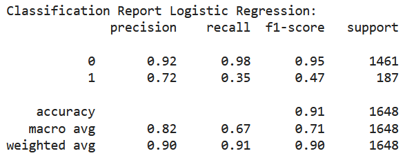
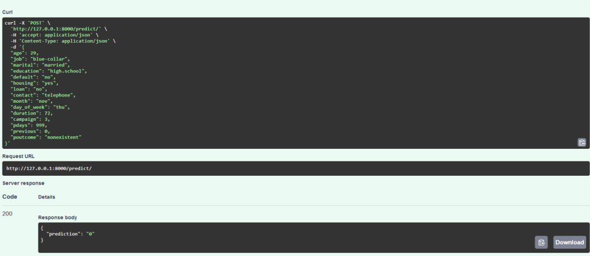
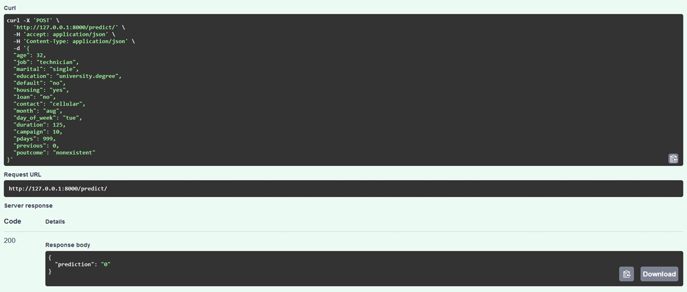

# Bank Customer Classification: Predicting Term Deposit Subscriptions

## Executive Summary

This project aims to classify bank customers and predict their likelihood of subscribing to a term deposit using machine learning. By analyzing customer data from a direct marketing campaign, we built a predictive model to help identify potential subscribers. Two machine learning algorithms—Support Vector Machine (SVM) and Logistic Regression—were compared, and the best-performing model was selected for deployment using FastAPI. The outcome of this project allows the bank to target marketing efforts more efficiently, improving customer outreach and increasing subscription rates.

## Business Problem

The bank wants to enhance the effectiveness of its marketing campaigns aimed at encouraging customers to subscribe to term deposits. However, not all customers are equally likely to respond positively, and marketing to uninterested customers leads to unnecessary costs. The objective is to develop a machine learning model that can predict whether a customer will subscribe to a term deposit, allowing the bank to focus its efforts on high-potential leads, thereby optimizing resources and improving subscription rates.

## Data Analysis

### Correlation Heatmap

The correlation heatmap is used to visualize the relationship between various features. A negative or positive correlation can provide insights into how certain variables impact the likelihood of a customer subscribing to a term deposit.

Here is the correlation heatmap that highlights important relationships such as:

- A high negative correlation between `pdays` and `previous`: The more frequently a customer has been contacted in the past, the shorter the time since the last contact.
- A strong positive correlation between `y` and `duration`: The longer the contact duration, the more likely the customer is to subscribe to a term deposit.
- A high negative correlation between `y` and `pdays`: The longer the time since the last contact, the less likely the customer is to subscribe.

## Methodology

### Dataset Source
- The dataset used for this project is the [Bank Marketing Dataset](http://archive.ics.uci.edu/ml/datasets/Bank+Marketing#) from the UCI Machine Learning Repository.

### Data Preprocessing
- **Handle Missing Values**: Imputation techniques were applied to fill in missing values for both categorical and numerical columns.
- **Encoding Categorical Variables**: One-Hot Encoding for nominal features and Ordinal Encoding for ordinal features.
- **Feature Scaling**: Standardization of numerical features using a Standard Scaler.

### Model Selection
- **Algorithms Used**:
  - Support Vector Machine (SVM) 
  - Logistic Regression
- **Evaluation Metrics**:
  - Accuracy, Precision, Recall, and F1-score.
  - ### SVM Classification Report:

  - ### Logistic Regression Classification Report:

- **Model Selection**:
  - Choose the model with the best performance based on the classification reports and confusion matrices.

### Model Deployment
- Save the best-performing model, encoders, and scaler using `pickle`.
- Deploy the model using **FastAPI** and create a `POST` endpoint for predictions.
- Conduct three test cases on the FastAPI deployment.
- ### FastAPI Test Result:

## Skills Utilized

- **Data Preprocessing**: Handling missing data, encoding categorical variables, and feature scaling.
- **Machine Learning**: Training and evaluating classification models using SVM and Logistic Regression.
- **Model Evaluation**: Assessing models using precision, recall, F1-score, and confusion matrix.
- **Model Deployment**: Building and testing a machine learning API using FastAPI.
- **Python Programming**: Proficiency in `pandas`, `scikit-learn`, `FastAPI`, and data manipulation.

## Results & Business Recommendation

- **Model Performance**:
  - Logistic Regression performed better overall, achieving an accuracy of **91%**.
  - It exhibited higher precision and recall for predicting customer subscriptions than the SVM model.
  - This model successfully identifies potential customers likely to subscribe to a term deposit, enabling the bank to refine its marketing strategy.

- **Business Recommendation**:
  - The bank should use the Logistic Regression model to focus its marketing efforts on customers with a higher predicted probability of subscribing.
  - By using the predictive model, the bank can target its marketing campaigns more effectively, reducing unnecessary outreach and improving return on investment (ROI).

## Next Steps

1. **Model Fine-Tuning**:
   - Further improve the Logistic Regression model by fine-tuning hyperparameters to enhance prediction accuracy.
2. **Feature Engineering**:
   - Introduce more advanced features, such as customer transaction history or credit scores, to improve the model's predictive power.
3. **A/B Testing**:
   - Implement A/B testing to validate the model’s performance in real-world marketing campaigns.
4. **Scaling Deployment**:
   - Deploy the model in a production environment to handle real-time predictions and integrate it into the bank's CRM system.
